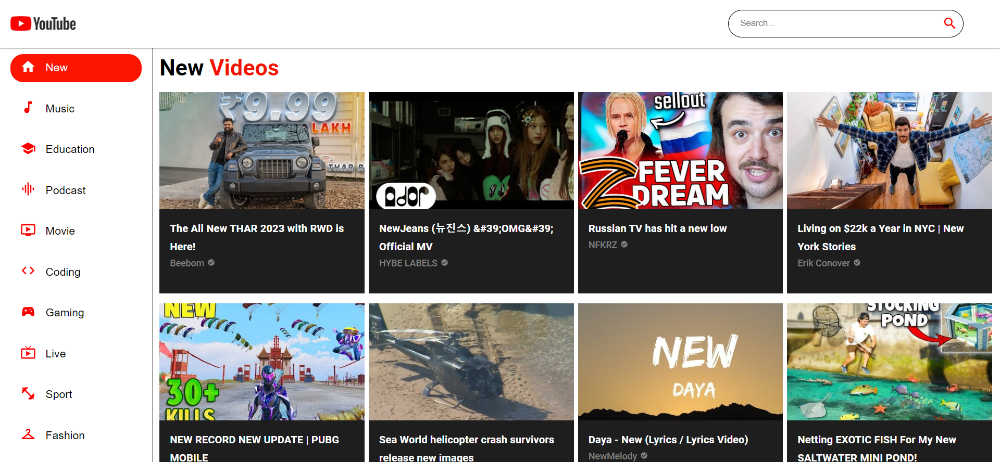
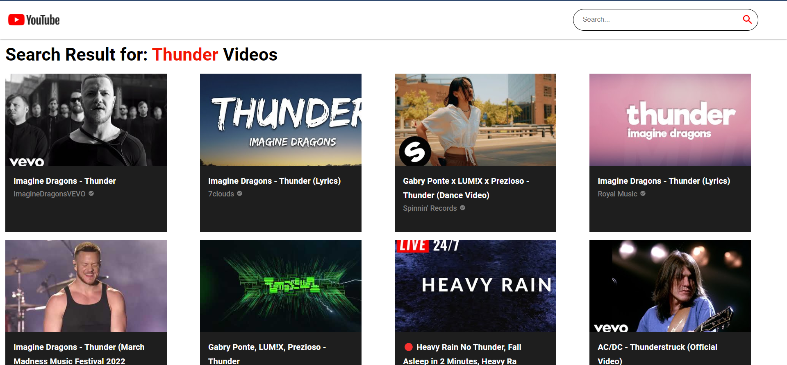
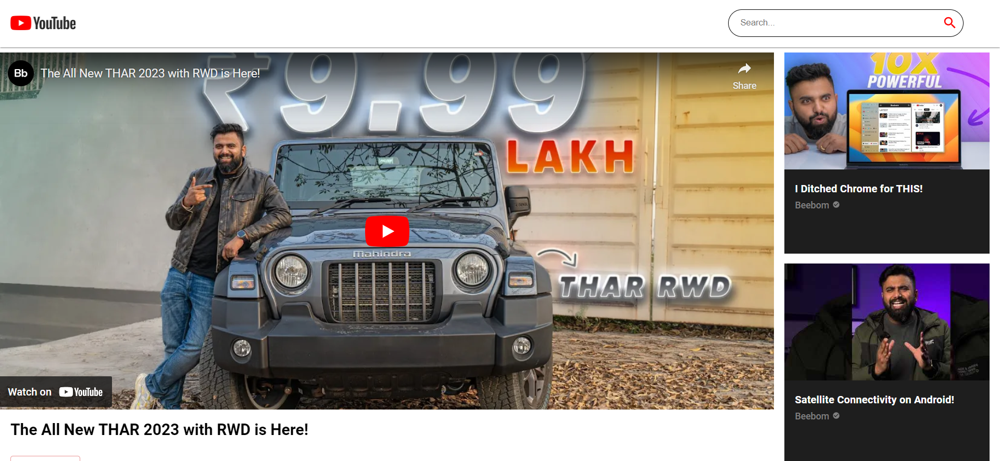
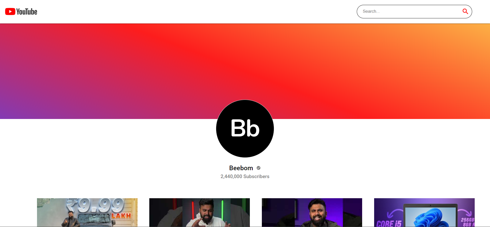

# Welcome to Youtube Clone 

---

## **Introduction**

YouTube is a video sharing service where users can watch, like, share, comment and upload their own videos. The video service can be accessed on PCs, laptops, tablets and via mobile phones.

## Tech-stack used

```
Frontend : React JS, Material-UI, HTML5, CSS3, JavaScript

API   : Rapid-API
```

**Sample Page Images**

---

**1) Home Page**

---

<a href="https://youtube-clone-react-pi.vercel.app/"></a>

**2) Search Page**

---

</img>

**3) Video Page**

---

</img>

**4) Channel Page**

---

</img>
